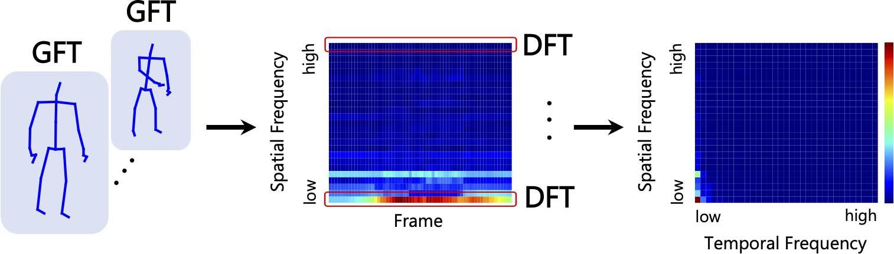

# Fourier Analysis on Robustness of Graph Convolutional Neural Networks for Skeleton-based Action Recognition (CVIU 2024)

## Description
This code is the source code of our paper "Fourier Analysis on Robustness of Graph Convolutional Neural Networks for Skeleton-based Action Recognition" in CVIU 2024.

Our Paper is [here](https://arxiv.org/abs/2305.17939).

In this code, we use [NTU RGB+D dataset](https://arxiv.org/pdf/1604.02808.pdf) and [ST-GCN model](https://arxiv.org/abs/1801.07455).



## Abstruct
Using Fourier analysis, we explore the robustness and vulnerability of graph convolutional neural networks (GCNs) for skeleton-based action recognition. We adopt a joint Fourier transform (JFT), a combination of the graph Fourier transform (GFT) and the discrete Fourier transform (DFT), to examine the robustness of adversarially-trained GCNs against adversarial attacks and common corruptions. Experimental results with the NTU RGB+D dataset reveal that adversarial training does not introduce a robustness trade-off between adversarial attacks and low-frequency perturbations, which typically occurs during image classification based on convolutional neural networks. This finding indicates that adversarial training is a practical approach to enhancing robustness against adversarial attacks and common corruptions in skeleton-based action recognition. Furthermore, we find that the Fourier approach cannot explain vulnerability against skeletal part occlusion corruption, which highlights its limitations. These findings extend our understanding of the robustness of GCNs, potentially guiding the development of more robust learning methods for skeleton-based action recognition.

## Notice
This code was custumized [the source code of ST-GCN](https://github.com/yysijie/st-gcn).  
In data preparation, We also used [the code of TCA-GCN](https://github.com/OrdinaryQin/TCA-GCN/tree/main).

Many thanks to the authors for all their works.

## Installation
### Environment
In our experiments, we used `Python = 3.7.10`.  
To set up environment, run;
```
pip install -r requirements.txt
cd torchlight
python setup.py install
cd ..

```

### Dataset
You can download NTU RGB+D dataset from [official website](https://rose1.ntu.edu.sg/dataset/actionRecognition/), and you place it in `./dataset/data/ntu/ntu_raw/`.  
Then, run;
```
cd ./dataset/data/ntu
python get_raw_skes_data.py
python get_raw_denoised_data.py
python seq_transformation.py
cd ../../..
```


## Training
To train the model, run;
```
python main.py recognition -c config/st_gcn/ntu-xsub/train_joint.yaml
```
When you train the model by adversarial training, run;
```
python main.py recognition -c config/st_gcn/ntu-xsub/train_free_joint.yaml
```
When you use the trained models, you should write the trained model's path to first line of yaml files in `./config/st_gcn/ntu-xsub/`.

## Testing
To test these models, run;
```
python main.py recognition -c config/st_gcn/ntu-xsub/test_joint.yaml
python main.py recognition -c config/st_gcn/ntu-xsub/test_free_joint.yaml
```

## Adversarial Attack
To attack these models by PGD, run;
```
python main.py recognition -c config/st_gcn/ntu-xsub/attack_joint.yaml
python main.py recognition -c config/st_gcn/ntu-xsub/attack_free_joint.yaml
```

To evaluate these attacks, run;
```
python main.py recognition -c config/st_gcn/ntu-xsub/test_joint_ae.yaml
python main.py recognition -c config/st_gcn/ntu-xsub/test_free_joint_ae.yaml
```

## Common Corruptions
To make corrupted data, run;
```
cd ./dataset
python get_corruptions.py
cd ..
```

## Visualization of frequency spectrum
To get frequency spectrum of input data, run;
```
cd ./dataset
python get_frequency.py
python plot_spectrum.py -p joint_input_spectrum.pkl
cd ..
```

To get the spectrum of corruption, run;
```
cd ./dataset
python get_corrup_fre.py
python plot_spectrum.py -p "The path of .pkl file made by previous command"
cd ..
```

To get the spectrum of adversarial perturbation, we should do some processes.  
First, we collect the indices of data that can be corrrectly classified by the models.
```
python main.py recognition -c config/st_gcn/ntu-xsub/test_joint.yaml --save-ind True --ind-name stgcn_joint_indices.pkl
```

Next, we get the adversarial examples that is misclassified by the model.
```
python main.py recognition -c config/st_gcn/ntu-xsub/test_joint_ae2.yaml --ind-name stgcn_joint_indices.pkl --save-ae True
```

Finally, run;

```
cd ./dataset
python get_ad_fre.py
python plot_spectrum.py -p joint_perturbation_spectrum.pkl
cd ..
```

## Fourier heatmap
To generate Fourier heatmap, first, you should sample ramdomly 1000 data by following commands.
```
python main.py recognition -c config/st_gcn/ntu-xsub/test_joint.yaml --save-ind True --ind-name stgcn_joint_indices.pkl
cd ./dataset
python sample_data.py --indices-path ../stgcn_joint_indices.pkl
cd ../
```

Then, you can get fourier heatmap by following commands.
```
python main.py recognition -c config/st_gcn/ntu-xsub/test_joint_map.yaml
cd ./dataset
python plot_fourier_heatmap.py --datapath ../fourier_heatmap/fourier_map_stgcn_joint_norm0.50.txt
cd ../
```

## Citation
Nariki Tanaka, Hiroshi Kera, Kazuhiko Kawamoto, Fourier analysis on robustness of graph convolutional neural networks for skeleton-based action recognition, CVIU 2024.

@article{TANAKA2024103936,
title = {Fourier analysis on robustness of graph convolutional neural networks for skeleton-based action recognition},
journal = {Computer Vision and Image Understanding (CVIU)},
volume = {240},
pages = {103936},
year = {2024},
issn = {1077-3142},
doi = {https://doi.org/10.1016/j.cviu.2024.103936},
url = {https://www.sciencedirect.com/science/article/pii/S1077314224000171},
author = {Nariki Tanaka and Hiroshi Kera and Kazuhiko Kawamoto},
}
